# Documentación de Base de Datos — Sistema de Sueldos

> **Origen:** MySQL 5.5 — 5 empresas + 1 base master
> **Destino:** PostgreSQL 16
> **Última sincronización con la BBDD en vivo:** 2026-08-07

---

## Resumen de módulos

La base original es un ERP completo. Para el proyecto de sueldos, el módulo central es **`sld_`**.
Los demás módulos son parte de la aplicación de origen y **no se migran** en la primera fase.

| Prefijo | Módulo | Tablas en `sueldos` (Postgres) | Tablas en ERP original | Relevancia |
|---------|--------|:--:|:--:|------------|
| `sld_` | **Sueldos / Nómina** | 46 | 38 (crecido durante la migración) | ✅ CORE — migrado completo |
| `sys_` | Sistema (usuarios, empresas, sucursales, permisos) | 6 | 10 | ✅ Parcial — empresa, sucursal, user, group, user_group, dynamic_field |
| `bas_` | Tablas base / catálogos | 5 | 17 | ✅ Parcial — moneda, proyecto, provincia, localidad, importacion |
| `cnt_` | Contabilidad | 0 | 15 | ⬜ No se migra (solo se referenciaba desde `sld_recibo` en el análisis original; el vínculo no llegó a implementarse) |
| `fac_` | Facturación | 0 | 16 | ⬜ No se migra |
| `cmp_` | Compras | 0 | 30 | ⬜ No se migra |
| `vta_` | Ventas | 0 | 55 | ⬜ No se migra |
| `fnd_` | Fondos / Tesorería | 0 | 16 | ⬜ No se migra |
| `iva_` | IVA / Libro | 0 | 28 | ⬜ No se migra |
| `stk_` | Stock | 0 | 45 | ⬜ No se migra |

**Total tablas migradas y en uso:** 57 (5 `bas_` + 46 `sld_` + 6 `sys_`).

---

## Módulo SLD — Diagrama Entidad-Relación

```mermaid
erDiagram

    %% ─── SISTEMA (sys_) ──────────────────────────────────────────────────────

    sys_empresa {
        int id PK
        varchar razon_social
        varchar nombre_comercial
        varchar cuit
        varchar condicion_iva
        varchar direccion
        varchar localidad
        varchar provincia
        int empresa FK
        boolean cloud
        varchar workspace
    }

    sys_sucursal {
        int id PK
        int empresa FK
        varchar sucursal
        varchar direccion
        varchar localidad
        varchar codigo_zona
        boolean login
    }

    sys_user {
        varchar uid PK
        varchar name
        varchar password
        int empresa FK
        int nivel
        timestamp last_login
    }

    sys_group {
        varchar gid PK
        varchar description
    }

    sys_user_group {
        varchar uid PK
        varchar gid PK
    }

    sys_dynamic_field {
        varchar class PK
        varchar field PK
        varchar label
        varchar data_type
    }

    %% ─── CATÁLOGOS BASE (bas_) ───────────────────────────────────────────────

    bas_moneda {
        varchar id PK
        varchar nombre
        char simbolo
        decimal cotizacion
    }

    bas_provincia {
        varchar provincia PK
        varchar codigo
    }

    bas_localidad {
        varchar localidad PK
        varchar zona
        varchar provincia FK
        varchar cpa
    }

    bas_proyecto {
        varchar id PK
        varchar descripcion
        varchar grupo
        varchar moneda FK
        varchar id_padre FK
        boolean visible
    }

    bas_importacion {
        varchar tipo PK
        varchar id PK
        varchar descripcion
        varchar date_format
        varchar decimal_format
    }

    %% ─── CATÁLOGOS SUELDOS ───────────────────────────────────────────────────

    sld_obra_social {
        varchar id PK
        varchar descripcion
        decimal aporte_porcentaje
        decimal aporte_importe
        decimal retencion_porcentaje
        decimal retencion_importe
    }

    sld_sindicato {
        varchar id PK
        varchar descripcion
        decimal aporte_porcentaje
        decimal aporte_importe
        decimal retencion_porcentaje
        decimal retencion_importe
    }

    sld_grupo_de_conceptos {
        varchar id PK
        varchar descripcion
    }

    sld_grupo {
        varchar id PK
        varchar descripcion
    }

    sld_actividad_laboral {
        varchar id PK
        varchar descripcion
    }

    sld_condicion_laboral {
        varchar id PK
        varchar descripcion
    }

    sld_modalidad_contrato {
        varchar id PK
        varchar descripcion
    }

    sld_situacion_revista {
        varchar id PK
        varchar descripcion
    }

    sld_incapacidad {
        varchar id PK
        varchar descripcion
    }

    sld_codigo_zona {
        varchar id PK
        varchar descripcion
    }

    sld_motivo_ausentismo {
        varchar id PK
        varchar tipo
        varchar descripcion
        char simbolo
    }

    sld_tipo_novedad {
        varchar id PK
        varchar descripcion
        varchar data_type
    }

    sld_campo_historial {
        varchar id PK
        varchar descripcion
        varchar data_type
    }

    sld_feriado {
        date fecha PK
        varchar descripcion
    }

    sld_formula_auxiliar {
        varchar id PK
        varchar descripcion
        varchar formula
    }

    sld_tabla {
        varchar id PK
        varchar descripcion
        varchar column_1
        varchar data_type_1
    }

    %% ─── CONCEPTOS ───────────────────────────────────────────────────────────

    sld_concepto {
        varchar id PK
        varchar id_afip
        varchar descripcion
        varchar columna
        varchar formula_unidad
        varchar formula_importe
        varchar formula_unitario
        varchar formula_condicion
        boolean activo
    }

    sld_concepto_lsd {
        varchar concepto PK
        boolean aporte_sipa
        boolean aporte_inssjyp
        boolean aporte_obrasocial
        boolean contribucion_sipa
        boolean contribucion_obrasocial
        boolean contribucion_aaff
        boolean contribucion_fne
        boolean contribucion_lrt
        boolean repetible
    }

    sld_concepto_grupo {
        varchar grupo PK
        varchar concepto PK
    }

    sld_concepto_general {
        varchar concepto PK
        varchar liquidacion PK
        int recibo PK
        decimal unidad_manual
        decimal importe_manual
        date vigencia_desde
        date vigencia_hasta
    }

    sld_concepto_de_grupo {
        varchar grupo_de_conceptos PK
        varchar concepto PK
        varchar liquidacion PK
        int recibo PK
        decimal unidad_manual
        decimal importe_manual
        date vigencia_desde
        date vigencia_hasta
    }

    %% ─── CONVENIO Y CATEGORÍAS ───────────────────────────────────────────────

    sld_convenio {
        varchar id PK
        varchar descripcion
        varchar liquidacion
        decimal dias
        decimal horas
        varchar moneda FK
        varchar obra_social FK
        varchar grupo_de_conceptos FK
    }

    sld_categoria {
        varchar convenio PK
        varchar id PK
        varchar descripcion
        decimal sueldo
        decimal adicional
        varchar jornada
        varchar liquidacion
    }

    sld_categoria_periodo {
        varchar convenio PK
        varchar categoria PK
        date fecha PK
        date fecha_hasta
        decimal sueldo
        decimal adicional
    }

    %% ─── EMPLEADO (entidad central) ──────────────────────────────────────────

    sld_empleado {
        int id PK
        varchar legajo
        varchar apellido
        varchar nombre
        varchar cuil
        varchar tarea
        date fecha_ingreso
        date fecha_egreso
        date fecha_nacimiento
        varchar sexo
        varchar estado_civil
        varchar tipo_documento
        varchar numero_documento
        varchar direccion
        varchar localidad
        varchar telefono
        varchar email
        varchar convenio FK
        varchar categoria FK
        decimal sueldo
        varchar moneda FK
        varchar obra_social FK
        varchar sindicato FK
        varchar proyecto FK
        int empresa FK
        varchar grupo_de_conceptos FK
        varchar banco
        varchar cbu
    }

    sld_empleado_afip {
        int empleado PK
        varchar situacion FK
        varchar condicion FK
        varchar actividad FK
        varchar modalidad FK
        varchar incapacidad FK
        varchar codigo_zona FK
        varchar situacion_revista_1 FK
        varchar situacion_revista_2 FK
        varchar situacion_revista_3 FK
    }

    sld_empleado_field {
        varchar class PK
        varchar field PK
        int entity PK
        varchar value
    }

    sld_familiar {
        int empleado PK
        varchar id PK
        varchar parentesco
        varchar apellido
        varchar nombre
        date fecha_nacimiento
        varchar cuil
        varchar sexo
        varchar discapacidad
        varchar adopcion
        varchar adherente
        varchar deducible
        decimal porcentaje
    }

    sld_jornada_laboral {
        int empleado PK
        varchar horario
        varchar feriados
    }

    sld_horario {
        int empleado PK
        varchar dia PK
        time entrada
        time salida
    }

    sld_ausentismo {
        int empleado PK
        varchar motivo PK
        date fecha_desde PK
        date fecha_hasta
        text observaciones
    }

    sld_presentismo {
        int empleado PK
        date fecha PK
        time hora PK
        varchar tipo
    }

    sld_novedad {
        int empleado PK
        varchar tipo_novedad PK
        date fecha PK
        varchar value
    }

    sld_historial_empleado {
        int empleado PK
        varchar campo PK
        date fecha_desde PK
        date fecha_hasta
        varchar valor
    }

    sld_empleado_concepto {
        int empleado PK
        varchar concepto PK
        varchar liquidacion PK
        int recibo PK
        decimal unidad_manual
        decimal importe_manual
        date vigencia_desde
        date vigencia_hasta
    }

    %% ─── LIQUIDACIÓN Y RECIBO ────────────────────────────────────────────────

    sld_liquidacion {
        varchar periodo PK
        varchar tipo
        varchar estado
        date fecha
        date fecha_desde
        date fecha_hasta
        varchar descripcion
        date fecha_pago
        varchar lugar_pago
    }

    sld_recibo {
        varchar periodo PK
        int empleado PK
        int numero PK
        decimal remunerativo
        decimal no_remunerativo
        decimal descuento
        decimal sueldo_neto
        decimal sueldo_bruto
        decimal contribucion
        decimal costo_laboral
        varchar moneda FK
        decimal cotizacion
        varchar proyecto FK
        boolean mail
        boolean visible
    }

    sld_recibo_empleado {
        int empleado PK
        date fecha PK
        varchar tarea
        varchar convenio FK
        varchar categoria FK
        decimal sueldo
        varchar obra_social FK
        varchar sindicato FK
    }

    sld_recibo_concepto {
        varchar periodo PK
        int empleado PK
        int numero PK
        varchar concepto PK
        varchar descripcion
        decimal unidad
        decimal importe
        decimal unitario
        boolean condicion
        boolean warning
        boolean error
        date vigencia_desde
        date vigencia_hasta
    }

    sld_recibo_afip {
        int empleado PK
        date fecha PK
        varchar situacion FK
        varchar condicion FK
        varchar actividad FK
        varchar modalidad FK
        varchar incapacidad FK
        varchar codigo_zona FK
    }

    %% ─── HISTÓRICOS Y CONFIGURACIÓN GLOBAL ──────────────────────────────────

    sld_historial {
        varchar campo PK
        date fecha_desde PK
        date fecha_hasta
        varchar valor
    }

    sld_fila {
        varchar tabla PK
        int fila PK
        varchar value_1
        varchar value_2
        varchar value_9
    }

    %% ─── IMPORTACIÓN DE NOVEDADES ────────────────────────────────────────────

    sld_importacion {
        varchar tipo PK
        varchar importacion PK
        boolean valor_cero
    }

    sld_importacion_novedad {
        varchar tipo PK
        varchar importacion PK
        int numero PK
        varchar tipo_novedad FK
        char novedad_col
        char valor_col
    }

    %% ─── INFORMES ────────────────────────────────────────────────────────────

    sld_informe {
        varchar id PK
        varchar descripcion
        varchar tabla
        varchar agrupacion
        varchar ordenamiento
        varchar orientation
        varchar page_size
        varchar condicion
    }

    sld_informe_campo {
        varchar informe PK
        int campo PK
        varchar tipo
        varchar descripcion
        varchar formula
        varchar data_type
        varchar group_function
    }

    %% ─── RELACIONES ──────────────────────────────────────────────────────────

    %% Sistema
    sys_empresa ||--o{ sys_empresa : "empresa (grupo económico)"
    sys_empresa ||--o{ sys_sucursal : "empresa"
    sys_empresa ||--o{ sys_user : "empresa"
    sys_user ||--o{ sys_user_group : "uid"
    sys_group ||--o{ sys_user_group : "gid"
    sys_dynamic_field ||--o{ sld_empleado_field : "class+field"

    %% bas_ → sld_
    bas_provincia ||--o{ bas_localidad : "provincia"
    bas_moneda ||--o{ bas_proyecto : "moneda"
    bas_proyecto ||--o{ bas_proyecto : "id_padre"
    bas_moneda ||--o{ sld_convenio : "moneda"
    bas_moneda ||--o{ sld_empleado : "moneda"
    bas_moneda ||--o{ sld_recibo : "moneda"
    bas_proyecto ||--o{ sld_empleado : "proyecto"
    bas_proyecto ||--o{ sld_recibo : "proyecto"
    bas_importacion ||--o{ sld_importacion : "tipo+id"
    bas_importacion ||--o{ sld_importacion_novedad : "tipo+id"
    sys_empresa ||--o{ sld_empleado : "empresa"

    %% Convenio → Categoría → Empleado
    sld_obra_social ||--o{ sld_convenio : "obra_social"
    sld_grupo_de_conceptos ||--o{ sld_convenio : "grupo_de_conceptos"
    sld_convenio ||--o{ sld_categoria : "convenio"
    sld_categoria ||--o{ sld_categoria_periodo : "convenio+categoria"
    sld_categoria ||--o{ sld_empleado : "convenio+categoria"
    sld_obra_social ||--o{ sld_empleado : "obra_social"
    sld_sindicato ||--o{ sld_empleado : "sindicato"
    sld_grupo_de_conceptos ||--o{ sld_empleado : "grupo_de_conceptos"

    %% Concepto
    sld_concepto ||--|| sld_concepto_lsd : "concepto"
    sld_concepto ||--o{ sld_concepto_general : "concepto"
    sld_grupo ||--o{ sld_concepto_grupo : "grupo"
    sld_concepto ||--o{ sld_concepto_grupo : "concepto"
    sld_grupo_de_conceptos ||--o{ sld_concepto_de_grupo : "grupo_de_conceptos"
    sld_concepto ||--o{ sld_concepto_de_grupo : "concepto"

    %% Empleado → sub-tablas
    sld_empleado ||--|| sld_empleado_afip : "empleado"
    sld_empleado ||--o{ sld_empleado_field : "entity"
    sld_empleado ||--o{ sld_familiar : "empleado"
    sld_empleado ||--|| sld_jornada_laboral : "empleado"
    sld_jornada_laboral ||--o{ sld_horario : "empleado"
    sld_empleado ||--o{ sld_ausentismo : "empleado"
    sld_empleado ||--o{ sld_presentismo : "empleado"
    sld_empleado ||--o{ sld_novedad : "empleado"
    sld_empleado ||--o{ sld_historial_empleado : "empleado"
    sld_empleado ||--o{ sld_empleado_concepto : "empleado"
    sld_empleado ||--o{ sld_recibo_empleado : "empleado"
    sld_empleado ||--o{ sld_recibo_afip : "empleado"

    %% Motivos de ausentismo
    sld_motivo_ausentismo ||--o{ sld_ausentismo : "motivo"

    %% AFIP lookups (empleado_afip y recibo_afip comparten los mismos catálogos)
    sld_situacion_revista ||--o{ sld_empleado_afip : "situacion (x4: actual + histórico 1-3)"
    sld_condicion_laboral ||--o{ sld_empleado_afip : "condicion"
    sld_actividad_laboral ||--o{ sld_empleado_afip : "actividad"
    sld_modalidad_contrato ||--o{ sld_empleado_afip : "modalidad"
    sld_incapacidad ||--o{ sld_empleado_afip : "incapacidad"
    sld_codigo_zona ||--o{ sld_empleado_afip : "codigo_zona"
    sld_situacion_revista ||--o{ sld_recibo_afip : "situacion (x4: actual + histórico 1-3)"
    sld_condicion_laboral ||--o{ sld_recibo_afip : "condicion"
    sld_actividad_laboral ||--o{ sld_recibo_afip : "actividad"
    sld_modalidad_contrato ||--o{ sld_recibo_afip : "modalidad"
    sld_incapacidad ||--o{ sld_recibo_afip : "incapacidad"
    sld_codigo_zona ||--o{ sld_recibo_afip : "codigo_zona"

    %% Novedades
    sld_tipo_novedad ||--o{ sld_novedad : "tipo_novedad"
    sld_tipo_novedad ||--o{ sld_importacion_novedad : "tipo_novedad"

    %% Historial
    sld_campo_historial ||--o{ sld_historial : "campo"
    sld_campo_historial ||--o{ sld_historial_empleado : "campo"

    %% Tabla → filas
    sld_tabla ||--o{ sld_fila : "tabla"

    %% Informes
    sld_informe ||--o{ sld_informe_campo : "informe"

    %% Liquidación → Recibo → Conceptos
    sld_liquidacion ||--o{ sld_recibo : "periodo"
    sld_empleado ||--o{ sld_recibo : "empleado"
    sld_recibo ||--o{ sld_recibo_concepto : "periodo+empleado+numero"
    sld_concepto ||--o{ sld_recibo_concepto : "concepto"
    sld_concepto ||--o{ sld_empleado_concepto : "concepto"
    sld_categoria ||--o{ sld_recibo_empleado : "convenio+categoria"
    sld_obra_social ||--o{ sld_recibo_empleado : "obra_social"
    sld_sindicato ||--o{ sld_recibo_empleado : "sindicato"
```

---

## Descripción de tablas — Módulo SLD

### Sistema (`sys_`)

| Tabla | Descripción |
|-------|-------------|
| `sys_empresa` | Empresa/razón social. Auto-referenciada por `empresa` para agrupar empresas de un mismo grupo económico. |
| `sys_sucursal` | Sucursales de una empresa. |
| `sys_user` | Usuarios del sistema original (login, nivel de permisos). |
| `sys_group` | Grupos de permisos. |
| `sys_user_group` | Relación N:M entre usuarios y grupos. |
| `sys_dynamic_field` | Definición de campos dinámicos/custom por clase de entidad. |

### Catálogos base (`bas_`)

| Tabla | Descripción |
|-------|-------------|
| `bas_moneda` | Monedas y cotización. |
| `bas_provincia` | Provincias (Argentina). |
| `bas_localidad` | Localidades, con FK a provincia. |
| `bas_proyecto` | Proyectos/centros de costo, con jerarquía (`id_padre`) y moneda. |
| `bas_importacion` | Configuración de formatos de importación CSV (fecha, decimales, separador). |

### Catálogos / Tablas maestras (`sld_`)

| Tabla | Descripción |
|-------|-------------|
| `sld_actividad_laboral` | Tipos de actividad laboral (para AFIP) |
| `sld_campo_historial` | Define qué campos se auditan históricamente |
| `sld_codigo_zona` | Códigos de zona geográfica (AFIP) |
| `sld_condicion_laboral` | Condiciones laborales AFIP (ej: normal, discapacitado) |
| `sld_feriado` | Calendario de feriados nacionales/locales |
| `sld_formula_auxiliar` | Fórmulas reutilizables en cálculos de recibo |
| `sld_grupo` | Agrupación de empleados para reportes o carga masiva |
| `sld_grupo_de_conceptos` | Template de conceptos aplicable a empleados/convenios |
| `sld_incapacidad` | Tipos de incapacidad (AFIP) |
| `sld_modalidad_contrato` | Modalidades de contratación AFIP |
| `sld_motivo_ausentismo` | Causas de ausencia (voluntario/involuntario) |
| `sld_obra_social` | Obras sociales con sus porcentajes de aporte |
| `sld_sindicato` | Sindicatos con sus porcentajes de retención |
| `sld_situacion_revista` | Situación de revista del trabajador (AFIP) |
| `sld_tabla` | Tablas paramétricas de hasta 9 columnas tipadas (para fórmulas) |
| `sld_tipo_novedad` | Tipos de novedades imputables por empleado |

### Conceptos

| Tabla | Descripción |
|-------|-------------|
| `sld_concepto` | Ítem de liquidación: remunerativo, descuento, contribución, auxiliar. Contiene la fórmula de cálculo. |
| `sld_concepto_lsd` | Flags AFIP (LSD) por concepto: si aporta a SIPA, INSSJYP, obra social, etc. |
| `sld_concepto_general` | Concepto aplicable a **todos** los empleados (importe/unidad global). |
| `sld_concepto_de_grupo` | Concepto aplicable a todos los empleados de un **grupo de conceptos**. |
| `sld_concepto_grupo` | Asigna conceptos a un grupo (agrupación de empleados). |

### Convenio y Categorías

| Tabla | Descripción |
|-------|-------------|
| `sld_convenio` | Convenio colectivo de trabajo. Define la modalidad de liquidación, obra social por defecto y grupo de conceptos. |
| `sld_categoria` | Categoría dentro de un convenio. Define sueldo básico y tipo de jornada. PK compuesta: `(convenio, id)`. |
| `sld_categoria_periodo` | Histórico de sueldos por categoría (cada actualización salarial genera una fila). |

### Empleado

| Tabla | Descripción |
|-------|-------------|
| `sld_empleado` | **Tabla central**. Datos personales, laborales y salariales del trabajador. FK a convenio+categoría, obra social, sindicato, empresa, proyecto. |
| `sld_empleado_afip` | Datos AFIP del empleado: situación de revista (actual + 3 históricas), condición, actividad, modalidad, zona. 1:1 con `sld_empleado`. |
| `sld_empleado_field` | Valores de campos dinámicos (`sys_dynamic_field`) para un empleado puntual. |
| `sld_familiar` | Grupo familiar del empleado (cónyuge, hijos). Incluye datos para cargas de familia AFIP. |
| `sld_jornada_laboral` | Configuración de horario del empleado (fijo/rotativo, trabaja feriados). 1:1 con `sld_empleado`. |
| `sld_horario` | Horario diario del empleado (entrada/salida por día de la semana). FK real hacia `sld_jornada_laboral.empleado`, no directo a `sld_empleado`. |
| `sld_ausentismo` | Registro de ausencias del empleado con motivo y rango de fechas. |
| `sld_presentismo` | Control de asistencia: entrada y salida con timestamp. |
| `sld_novedad` | Novedades por empleado y período (ej: días trabajados, horas extra). |
| `sld_historial_empleado` | Histórico de valores de campos auditados por empleado (ej: cambios de categoría). |
| `sld_empleado_concepto` | Override de concepto a nivel empleado (distinto de lo general/grupal). |

### Liquidación y Recibos

| Tabla | Descripción |
|-------|-------------|
| `sld_liquidacion` | Período de liquidación (ej: `2026-03`). Estado: ABIERTA → ACTIVA → CERRADA. Tipo: mensual, quincena, aguinaldo, vacaciones, etc. |
| `sld_recibo` | Recibo de sueldo. Cabecera con totales: remunerativo, descuentos, neto, bruto, contribuciones. PK: `(periodo, empleado, numero)`. |
| `sld_recibo_concepto` | Líneas del recibo: cada concepto liquidado con su unidad, unitario e importe. |
| `sld_recibo_empleado` | Snapshot de los datos laborales del empleado al momento del recibo (convenio, categoría, sueldo, etc.). |
| `sld_recibo_afip` | Snapshot de los datos AFIP del empleado al momento del recibo. |

### Tablas paramétricas, históricos e importación

| Tabla | Descripción |
|-------|-------------|
| `sld_tabla` | Tabla de hasta 9 columnas tipadas para usar en fórmulas de conceptos. |
| `sld_fila` | Filas de datos de `sld_tabla`. |
| `sld_historial` | Histórico de valores globales (no por empleado) de campos auditados. |
| `sld_importacion` | Configuración de importación CSV para novedades (referencia a `bas_importacion`). |
| `sld_importacion_novedad` | Columnas del CSV y su mapeo a tipos de novedad. |
| `sld_informe` | Configuración de informes/reportes del módulo. |
| `sld_informe_campo` | Columnas de cada informe. |

---

## Observaciones importantes para la migración

### 1. Arquitectura multi-empresa
La base original tiene **una database MySQL por empresa** (icp sa, minucci, thompson, zurawski). El campo `sld_empleado.empresa` FK a `sys_empresa.id` ya anticipa esto.
En PostgreSQL se usa **un solo schema** con la columna `empresa` como discriminador. `sys_empresa` también se auto-referencia (`empresa`) para agrupar empresas de un mismo grupo económico.

### 2. Enums MySQL → PostgreSQL
MySQL usa `ENUM(...)` a nivel de columna. En PostgreSQL se convierten a `VARCHAR` con `CHECK` constraints por mantenibilidad.

### 3. Tipos de datos
| MySQL | PostgreSQL |
|-------|-----------|
| `tinyint(1)` | `BOOLEAN` |
| `bit(1)` | `BOOLEAN` |
| `datetime` | `TIMESTAMP` |
| `blob` / `longblob` / `mediumblob` | `BYTEA` |
| `int(n)` | `INTEGER` |
| `decimal(p,s)` | `NUMERIC(p,s)` |
| `enum(...)` | `VARCHAR(n) CHECK(... IN (...))` |

### 4. Charset
Las tablas MySQL originales declaran `DEFAULT CHARSET=latin1`, pero los dumps (`mysqldump`)
ya están en **UTF-8** (cabecera `SET NAMES utf8`) — confirmado byte a byte. Hay que leerlos
como `utf8`, no como `latin1`; leerlos como `latin1` produce mojibake (`é` → `é`). Ver
`db/MIGRACION_BITACORA.md` sección 7 para el detalle del bug y el fix aplicado.

### 5. Fechas inválidas
MySQL admite `'0000-00-00'` como fecha. PostgreSQL no. La función `safe_date(text)` (definida en la BBDD) reemplaza estos valores por `NULL` durante la migración.

### 6. Columna `columna` en sld_concepto
El campo `columna` define la naturaleza del concepto en el recibo:
- `REMUNERATIVO` — suma al bruto
- `NO_REMUNERATIVO` — no suma al bruto
- `DESCUENTO` — resta del neto
- `CONTRIBUCION` — costo patronal
- `AUXILIAR` — variable de cálculo, no aparece en el recibo

### 7. Fórmulas de conceptos
Los campos `formula_unidad`, `formula_importe`, `formula_unitario` y `formula_condicion` en `sld_concepto` son expresiones en un lenguaje propio del sistema original. No son SQL ni JavaScript. Habrá que re-implementar un evaluador o mapearlos manualmente.

### 8. Tablas sin PRIMARY KEY explícita
`sld_concepto_de_grupo`, `sld_concepto_general` y `sld_empleado_concepto` no tienen `PRIMARY KEY` definida en Postgres — solo una restricción `UNIQUE` sobre las mismas columnas. Tenerlo en cuenta si se agregan FKs hacia ellas o se usan como tabla de detalle en un ORM.
